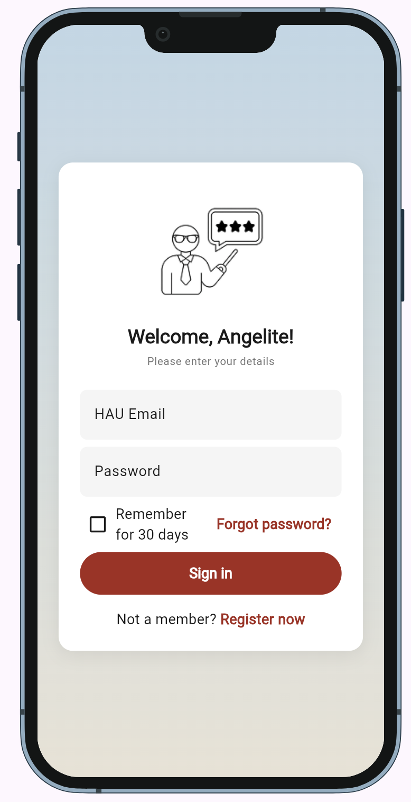
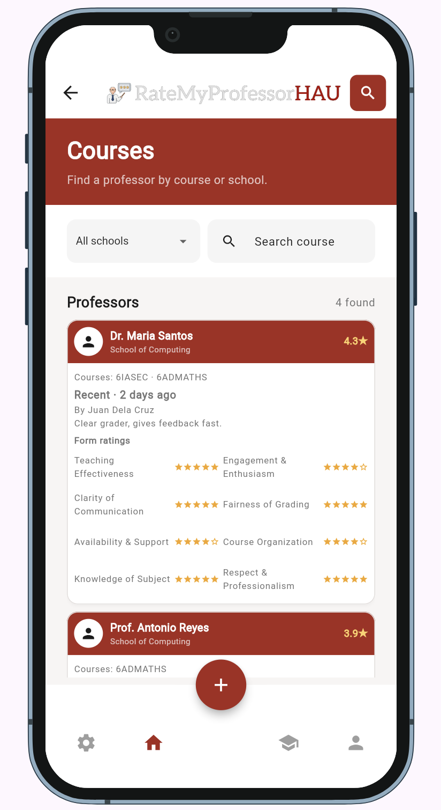
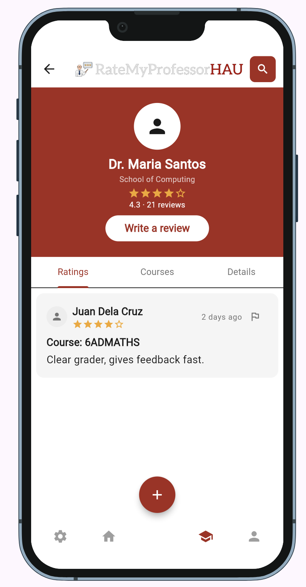
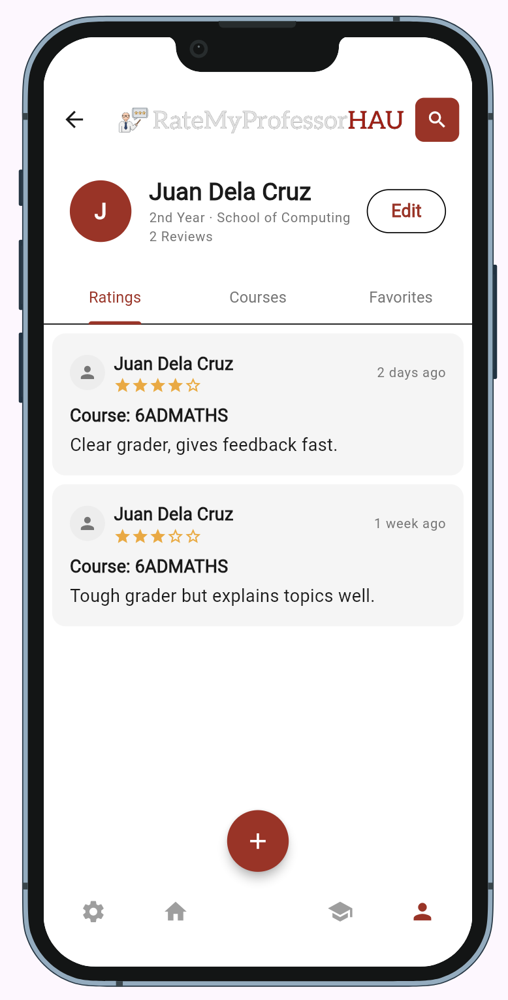
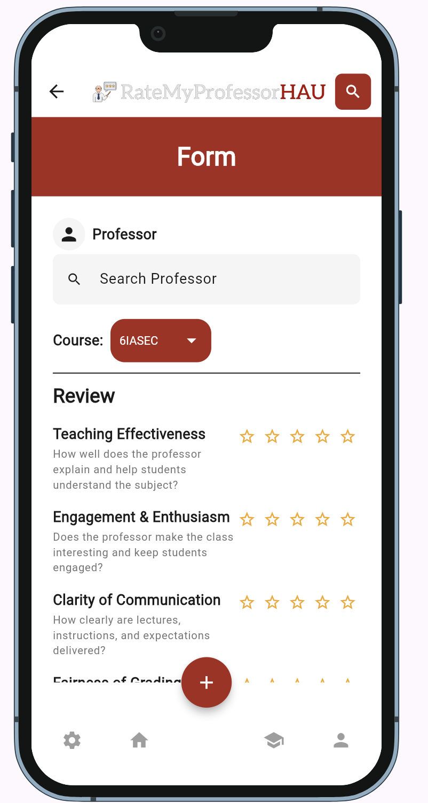

# RateMyProfessorHAU

**GitHub repository:** https://github.com/codewchester/RateMyProfessorHAU-Finals

**Live demo:** Not deployed yet

**Demo video:** https://drive.google.com/file/d/1PezCWLA-yDZCY8uTk3fW3pIFOyqwZklp/view?usp=sharing

**Course:** Applications Development and Emerging Technologies (6ADET), Holy Angel University

**Author:** Lester Manapul

## 1. Overview

RateMyProfessorHAU is a Flutter app concept for currently enrolled Holy Angel University students. Students can browse professors by school or course, view sample ratings and reviews, and fill out a review form with eight rating categories.

The app currently displays hardcoded sample data. Firebase Auth and Cloud Firestore were selected as the planned backend, but they have not been integrated, so reviews are not saved or shared between users yet.

## 2. Setup and installation

The project uses Flutter and Dart. The project notes list Flutter 3.44.9 and Dart 3.12.2.

To set up the project:

1. Install Flutter and make sure the `flutter` command is available in your terminal.
2. Clone the repository and open its folder.
3. Install the project dependencies:

   ```bash
   flutter pub get
   ```

4. Check which devices or browsers Flutter can use:

   ```bash
   flutter devices
   ```

## 3. How to run it

Run the app on a connected device or emulator:

```bash
flutter run
```

For a browser preview:

```bash
flutter run -d chrome
```

The course setup guide also supports running with:

```bash
flutter run -d web-server
```

## 4. Features and usage

**Login Screen**

The login screen has HAU email and password fields, a remember-me checkbox, and links for registration and password recovery. Authentication is not connected yet, so this screen does not sign users into a real account.

**Courses Screen**

Students can choose a school or department, search by course, and browse professor cards. The cards show sample professor details, course information, ratings, and review counts.

**Professor Reviews Screen**

The professor page shows a rating summary and tabs for ratings, courses, and details. Students can view sample reviews and open the review form. The report option currently opens a dialog and does not send reports to a backend.

**Profile Screen**

The profile page shows sample student information and tabs for ratings, courses, and favorites. Profile editing is still a placeholder, and favorites are not implemented.

**Review Form Screen**

Students can search for a professor, choose a course, rate eight categories, and add written feedback. The form has a confirmation step, but submissions are not saved because persistent storage is not connected.

**Primary Flow**

The intended flow starts at Login, continues to Courses, then to a professor’s review page. From there, a student can open the review form. The bottom navigation also provides access to Courses, Reviews, Profile, and Settings. The plus button opens the review form.

## 5. Project structure

```text
lib/
- main.dart
- theme.dart
- models/
  - professor.dart
  - review.dart
- screens/
  - course_page.dart
  - form_page.dart
  - login_page.dart
  - profile_page.dart
  - reviews_page.dart
  - stub_pages.dart
- widgets/
  - app_bottom_nav.dart
  - app_input_field.dart
  - app_search_bar.dart
  - app_top_bar.dart
  - professor_card.dart
  - review_card.dart
  - star_display.dart
  - star_rating_input.dart
  - tag_badge.dart
```

**Important files**

- `main.dart` starts the app, applies the theme, and sets up screen routes.
- `theme.dart` defines the shared colors, text styles, and spacing.
- `models/` contains the Professor and Review data structures and sample data.
- `screens/` contains the app’s pages.
- `widgets/` contains reusable interface parts, including professor cards, review cards, star ratings, the top bar, and bottom navigation.

## 6. Screenshots

| Login | Courses | Professor reviews |
| --- | --- | --- |
|  |  |  |

| Profile | Review form |
| --- | --- |
|  |  |

## 7. Known issues and next steps

**Known issues**

- The app uses sample data and does not yet save reviews.
- Firebase Auth and Cloud Firestore are not connected.
- The HAU email-domain check is not implemented.
- Registration, password recovery, Settings, and Edit Profile are placeholders.
- Favorites are not implemented, and the report dialog is not connected to a moderation system.
- The project still needs a final build and analyzer check before submission.

**Next steps**

- Run `flutter pub get`, `flutter analyze`, and the app, then address any errors.
- Set up Firebase Auth and Cloud Firestore.
- Add and verify HAU email checking.
- Save a review and confirm it remains available after the app restarts.
- Connect the report action to review moderation.
- Record the demo video and deploy the app if possible.
- Update the security and privacy checklist after adding Firebase and before making the repository public.

## Security checklist

See the [security and privacy checklist](docs/06-security-and-privacy.md). Review it again after adding Firebase and before making the repository public.

## Credits

- Framework: Flutter
- Language: Dart
- Package: `device_preview` (see `pubspec.yaml`)
- App images and logo: `assets/images/`

## AI usage

Claude and ChatGPT helped with code for parts of the app, including screens, reusable widgets, models, and navigation. I coded `theme.dart`, `app_bottom_nav.dart`, and `app_top_bar.dart` myself. I used the AI suggestions as part of development and am responsible for reviewing and verifying the final code.

See [`AI-USAGE.md`](AI-USAGE.md) for the usage log. It still needs the remaining real usage entries, correction examples, and commit links before submission.

## Presentation

- **Slides:** [RateMyProfessorHAU presentation](docs/assets/RateMyProfessorHAU_Presentation.pptx)
- **Square image (1080 × 1080):** [RateMyProfessorHAU social image](docs/assets/RateMyProfessorHAU_Square.png)
- **Demo video:** https://drive.google.com/file/d/1PezCWLA-yDZCY8uTk3fW3pIFOyqwZklp/view?usp=sharing

## License

MIT License. See [LICENSE](LICENSE).
